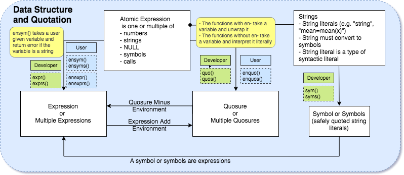
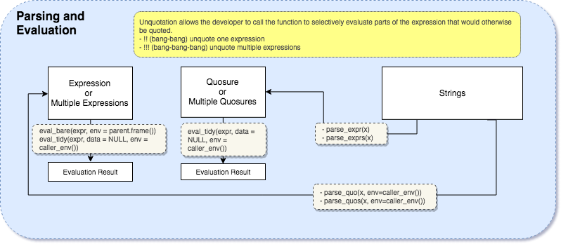

\pagebreak
```{r setup, include=FALSE}
knitr::opts_chunk$set(echo = TRUE)
```

```{r echo=FALSE, message=FALSE, warning=FALSE}
library(rlang)
library(dplyr)
library(stringr)
library(purrr)
library(knitr)
library(ggplot2)
library(knitr)
data(diamonds)
```


#Executive Summary
Data analysts who use R as their main tool for data exploration, analysis and visualization may have to write programs to automate some processes. Many functions in the Tidyverse packages use non-standard evaluation, where the arguments passed are not evaluated but rather taken as variable names. This creates some difficulties in passing arguments into a function, and the library, Rlang, provides its solutions. 

This report was inspired by the Metaprogramming Section, *Advanced R*, written by Hadley Wickham. The language used in the report is jargonistic, which makes the content precise but less comprehensive. The report aims to simplify the key concepts by introducing minimal amount of new terminology, but with greater focus on commonly used data types. Throughout this report, single and plural forms and different data types are constantly compared to demonstrate the use of Rlang functions. The report also provides some insights and code examples on working with questionnaire data, where a column represents one or one part of a question result. The final section of the analysis presents three main drawbacks of the Rlang library and serves as a word of caution for choosing and using the Rlang library. If one wishes to analyze questionnaire data without diving too deep to the theoretical part of the library, one can jump directly to Section 3.4, *Common Practice in Survey Data*, which provides some use cases of using rlang with Tidyverse packages.


#Introduction
R is a powerful tool for interactive data analysis, but programming in R can be appalling, since many functions in Tidyverse packages use non-standard evaluation. Also, scoping issues can occur when evaluating a variable. The Rlang library provides its solutions to those issues. The library adopted some base R functions and made them compatible to the Tidyverse packages. The Rlang library also creates a special data type called quosure, which allows quasiquotation, environment-binding and evaluation.

The newest version of Rlang (0.2.0) was publised on February 20, 2018, some functions are deprecated or soft deprecated in this version (Lionel, et al., 2018). Up till the time this report was written, there have not been many posts about this update. The current available references and tutorials are *Advanced R* and the documentations. *Advanced R*, written by Hadley Wickham, introduces epxression, quasiquotation, evaluation and some other relevant topics in the Metaprogramming section. The Metaprogramming section covers detailed definitions, common mistakes, warnings and examples. Although reading the whole section is the most desirable for thorough understanding, it can be time consuming to derive a solution to an actual issue. However, if one would like to read just one section or chapter, the concepts and definitions can be confusing. This is because the book uses self-defined structures and terminology, and the familarity is assumed once those are introduced. Due to the lack of an overall structure to connect the key concepts in this library, one may feel lost in type conversions and frustrated by trial-and-errors. This report gives an overview of the library and includes diagrams to aid understanding.


<!-- \pagebreak -->

#Analysis

## Quasiquotation and Data Types 

```{r echo=FALSE}
cap1 <- "Data Structure and Quotation"
```

```{r echo=FALSE, out.width="90%", fig.align='center', fig.cap=cap1, fig.pos='h'}

```

### Quasiquotation
Quasiquotation contains quotation and unquotation. Quotation captures a combination of constants, symbols and function calls as an argument, but does not evaluate it. The quoted information will be evaluated, unquoted or modified for future use. The functions without "en" prefix take in an argument and quote it as it is. The argument quoted is called "developers' expressions" since its often supplied by developers and used within a function. The ones with "en" prefix take in an argument, unwrap it and quote its value. The variables unwrapped and evaluated are called "users' expressions", as they are usually passed into a function. Unquotation allows a function to evaluate with the quoted value. The exclaimation marks, ```!!``` and ```!!!```, unquote the singular and plural form of a quotation respectively. A developer may wish to pass arguments as new column names but encounters frustration with functions like ```dplyr::mutate()```, the solution to this will be introduced in Section 3.4.3, *Taking New Column Variable Names as Arguments*.

It worth noting that objects quoted by functions in ```expr()```, ```sym()```, and ```quo()``` families are considered as quoted objects. Strings are not quoted in this context, although strings are wrapped in quotation marks.


### Expressions


|Interpretation       | Quote-expr()| Quote-sym() | Unquote  |
|-------------------- |------------	|------------	|--------- |
| direct  	          | expr()    	| sym()      	|!!        |
| direct  	          | exprs()   	| syms()    	|!!!       |
| function argument 	| enexpr()  	| ensym()   	|!!        |
| function arguments  | enexprs() 	| ensyms() 	  |!!!       |

Table: The expr() and sym() families


Figure 1 describes the "building blocks" of expression as numbers, string, NULL, symbols and calls, and defines them as atomic expressions. The similar concept in *Advanced R* is called Abstract Syntax Tree (Wickham, 2018). An expression is a combination or multiple combinations of atomic expressions being quoted by ```expr()```, ```exprs()```, ```enexpr()``` and ```enexprs()```, where ```expr()``` and ```exprs()``` take in a developer defined expression, and the function with "en" as suffix take in a variable as a placeholder and extract expression from it. The plural form of the those functions take in multiple expressions or variables.

#### Constants
Constants are syntactic literals as well as atomic vectors of length 1. Since a constant can be evaluated literally, constants are often said to be "self-quoting". 
```{r}
# Wickham, H (2018) Advanced R [Source code].
## https://adv-r.hadley.nz/expressions.html#abstract-syntax-trees
identical(expr("abc"), "abc")    
identical(expr(FALSE), FALSE)     
identical(expr(1), 1) 
identical(expr(NULL), NULL)
```
##### Strings
String is a type of syntactic literal. ```sym()``` and ```syms()``` quote string or strings into symbols. The ```ensym()``` and ```ensyms()``` functions, however, do not extract the value from the strings. Rather, they examine if the expression or expressions taken are strings and return error if they are. Strings must be wrapped in a symbol to be deparsed by ```quo()``` or ```expr()```.

#### Symbols
Symbols are individual strings that stored in a special way and represent variable names. When a symbol is evaluated, the variable name is unwrapped and the value is evaluated in the current environment (Wickham, 2018).

```{r}
x <- "abc"
identical(x, "abc")    
```

#### Calls
Calls are lists of constants and symbols with operators (+, -, etc), or function calls (```read.table()```, etc). A call has length larger than one and may contain other calls. The elements in calls can be extracted or modified with ```[[```, ```[``` and ```$``` (Wickham, 2018). The first element of a call is the function call, so the number of arguments is the ```length()``` of the call minus one. The ```names()``` of a call will be empty except the named arguments. The named arguments then can be selected by ```$``` and modified. Since R has flexible rules for argument matching, after an expression has been read, the order of argument names can be different, and the arguments' names can be full or abbreviated. The solution to this issue is using ```lang_standardise()``` to force the names to standardise all arguments (Wickham, 2018).

```{r}
# Wickham, H (2018) Advanced R [Source code].
#   https://adv-r.hadley.nz/expressions.html#abstract-syntax-trees
x <- lang_standardise(expr(read.table("important.csv", row=FALSE)))
## Call length() - 1 to obtain the number of arguments. 
length(x) - 1
names(x)
x$row
x$row <- TRUE
x

```

### Quosure

|Interpretation         | Quote-quo()|Unquote |
|-----------------------|------------|--------|
| direct                | quo()      |!!      |
| direct (plural)       | quos()     |!!!     |
| function argument     | enquo()    |!!      |
| function arguments    | enquos()   |!!!     |

Table: The quo() family


A quosure combines an expression and an environment. Internally, R represents function arguments as a "promise", a special type of object. Like a quosure, a promise captures the expression that needs to compute and the environment in which to compute it (Wickham, 2018). Promises are not accessible in a sense that at the moment the promise is accessed, the expression in the promise is evaluated and the promise disappears. Rlang manipulates promises and reify them into an R object (Wickham, 2018). Functions ```quo()``` and ```quos()``` are used to create quosure or quosures for variables given by a developer. The variables passed in those functions will be quoted literally. On the other hand, functions ```enquo()``` and ```enquos()``` take in a user given variable, unwrap it and encode the value to quosures. 


#### Environment Binding
Environment is where the program looks for definition of variables and it follows rules of lexical scoping. In general, an environment is similar to a named list, but every name must be unique and unordered. Every environment has a parent and is not to be copied when being modified (Wickham, 2018). The most common environment used within the scope of this report is the global environment, ```global_env()```. The global environment is also the workspace where interactive computation takes place (Wickham, 2018). In base R, functions like ```subset()``` takes in a data frame and scopes column names from the given symbols. In the following example, x, y and z are bare column names, but still make correct scoping because the given environment is the data frame.


```{r}
subset(diamonds, x==0 & y==0 & z==0)
```


When evaluating a quosure, the expression is evaluted in the binded environment. The expressions quoted by ```quo()```, ```quos()```, ```enquo()``` and ```enquos()``` have an environment of ```caller_env()``` by default. The binded environment solves the conflicts if variable names within the scope of the function during evaluation, and allows a developer to use column names as variables (Wickham, 2018). This will be elaborated in *3.2.3 Tidy Evaluation* section below. 


### Formulas and Frames
A formula is an expression with ~, . or .x. and a frame is a data frame.


### Summary
The following table provides a summary of the hierarchy and definitions of some common data types.


|                          | expr("1") | expr(1) | quo(x) | quo(x+1) | quo(x~y) | sym("x") |quos(x+y, y+z) |
|--------------------------|-----------|---------|--------|----------|----------|----------|---------------|
| is_expression()          | TRUE      | TRUE    | TRUE   | TRUE     | TRUE     | TRUE     | FALSE         |
| is\_syntactic\_literal() | TRUE      | TRUE    | FALSE  | FALSE    | FALSE    | FALSE    | FALSE         |
| is_symbolic()            | FALSE     | FALSE   | FALSE  | FALSE    | FALSE    | TRUE     | FALSE         |
| is_quosure()             | FALSE     | FALSE   | TRUE   | TRUE     | TRUE     | FALSE    | FALSE         |
| is_call()                | FALSE     | FALSE   | FALSE  | TRUE     | TRUE     | FALSE    | FALSE         |
| is_formula()             | FALSE     | FALSE   | FALSE  | FALSE    | TRUE     | FALSE    | TRUE          |

Table: Summary of Predicate Functions


## Evalutaion

```{r echo=FALSE}
cap2 <- "Parsing and Evaluation"
```


```{r echo=FALSE, out.width="90%", fig.align='center', fig.cap=cap2, fig.pos='h'}

```


### Check Plurality
Some quasiquotation functions have both singular and plural forms, which makes type checking overwhelming during practice. The Rlang library provides ```is_quosure()``` and ```is_quosures()``` function to check the plurality for quosures. However, ```expr()``` family and ```sym()``` family do not have their predicate functions in plural forms. To avoid errors occurred due to plurality, one can use the plural form for all objects and treat the singular ones as a list with one element. 
```{r}
q <- quos(x+y, y+z)
is_quosure(q)
is_quosures(q)
q2 <- quo(x+y)
is_quosure(q2)
is_quosures(q2)
e1 <- expr(x+y)
is_expression(e1)
e2 <- exprs(x+y, y+z)
is_expression(e2)
```

However, there is a way to check the length when a quoted object is passed to a program with ```dots_n()```. If multiple objects are passed to a function, three dots, ```...```, are used to represent the unspecified arguments (Wickham, 2018). Rlang allows ```dots_n()``` to count the number of bare expression arguments.

```{r}
foo <- function(...){
  dots_n(...)
}
foo(x+y, y+z, z+q)
```

A more detailed example with ```dots_n()``` is provided in Section *3.4.1.4 Multiple Questions*.

### Bare Evaluation
In ```eval_bare()```, the function takes in two arguments, ```expr``` and ```env```, where ```expr``` is usually an expression or a symbol and ```env``` is the environment where the expression should be evaluated (Wickham, 2018).

However, ```eval_bare()``` may produce unexpected result due to the conflicting variable names within the scope of the function. 

```{r}
# Wickham, H (2018) Advanced R [Source code]. https://adv-r.hadley.nz/evaluation.html
x <- 10
eval_bare(expr(x))
y <- 2
eval_bare(expr(x+y), env(x=1000))
eval_bare(
  expr(x + y), 
  env(`+` = function(x, y) paste0(x, " + ", y))
)
```

```{r}
# Wickham, H (2018) Advanced R [Source code]. https://adv-r.hadley.nz/evaluation.html
foo <- function(x) {
  y <- 100
  x <- enexpr(x)
  eval_bare(x)
}
```

```{r}
# Wickham, H (2018) Advanced R [Source code]. https://adv-r.hadley.nz/evaluation.html
z <- 100
foo(z * 2)
y <- 10
foo(y * 2)
```


### Tidy Evaluation
#### Unquote using enquo() or enquos()
If ```enquo()``` is used to unquote an expression, the default environment, ```caller_env()```, is supplied.

```{r}
# Wickham, H (2018) Advanced R [Source code]. https://adv-r.hadley.nz/evaluation.html
foo1 <- function(x) {
  y <- 100
  x <- enquo(x)
  eval_tidy(x)
}
y <- 10
foo1(y * 2)
```


```{r}
# Wickham, H (2018) Advanced R [Source code]. https://adv-r.hadley.nz/evaluation.html
foo2 <- function(x) {
  y <- 100
  x <- enexpr(x)
  eval_bare(x, caller_env())
}
y <- 10
foo2(y * 2)
```

#### Data Mask 
The function ```eval_tidy()``` can include a **data mask**, a data frame where the evaluated expression wil scope variable definitions. Also, the binded environment from a quosure can serve as a parent envrionment by ```as_env()```. The child envrionment produced then can be passed to another quosure. (Wickham, 2018)


The first example shows how ```eval_tidy()``` can be used on a data frame. The second example takes the environment of the first quosure and evaluate by ```quo_set_env()```.

```{r}
# Wickham, H (2018) Advanced R [Source code]. https://adv-r.hadley.nz/evaluation.html
x <- 10
df <- data.frame(y = 1:10)
q1 <- quo(x * y)
eval_tidy(q1, df)
```

```{r}
# Wickham, H (2018) Advanced R [Source code]. https://adv-r.hadley.nz/evaluation.html#data-masks
df_env <- as_env(df, parent = quo_get_env(q1))
q2 <- quo_set_env(q1, df_env)
eval_tidy(q2)
q3 <- quo_set_env(quo(x-y), df_env)
eval_tidy(q3)
```


## Interrelationships and Manipulation
```{r echo=FALSE}
cap3 <-" Interrelationships and Manipulation"
```

```{r echo=FALSE, out.width="90%", fig.align='center', fig.cap=cap3, fig.pos='h'}
include_graphics("interrelationship.png")
```

### Quosure and Expressions to String
The three most commonly used data structures are quosures, expressions and strings. The conversion among the three structures are not always intuitive. A quosure or an expression can be converted to string by ```quo_label()```, ```quo_name()``` and ```quo_text()```. ```quo_text()``` and ```quo_label()``` first squash the nested expression with ```quo_squash()``` to one single expression. In the following example, ```quo_text()``` unwraps ```!!quo(bar)``` and returns a raw expression. The squshed expression will be evaluated in outermost environment. Errors can occur if the nested expressions are binded with different environment. (Lionel et al., 2018).

```{r}
q <- quo(foo(!!quo(bar)))
q
quo_squash(q)
quo_text(q)
expr_text(q)
quo_name(quo(sym))
quo_name(quo(!! sym))
```

```Quo_name(quo)``` squashes a quosure and transforms it to a simple string. While ```quo_label()``` and ```quo_text()``` can take in multiple quosures, ```quo_name()``` does not accept multiple quosures as its argument. 
```{r}
q <- quo(x+!!quo(y))
quo_label(q)
quo_name(q)
quo_text(q)
# quo_name(quos(x+y, y+z))
## Error: `expr` must quote a symbol, scalar, or call

```

```Quos_auto_name()``` and ```exprs_auto_name()``` deparse a list of quosures or expressions with ```quo_text()``` and ```expr_text()``` respectively, and assign the quosures or expressions with the disparsed results. 

```{r}
q <- exprs(x+y, y+z)
quo_label(q)
quo_text(q)
q <- exprs_auto_name(q, width = 60L)
quo_label(q)
quo_text(q)
```

### Strings to Expressions or Quosures
There are two methods to convert strings to expressions or quosures. The first method wraps the string in ```sym()``` or ```syms()```  and call ```quo()```, ```quos()```, ```expr()``` or ```exprs()```. ```quos()``` and ```exprs()``` can be directly called upon the unquoted symbols.

The second method uses ```parse_quo()``` and ```parse_expr()``` and their plural forms to parse a string. ```Parse_quo()``` requires an explicit supplied environment, and the parsed string results in a quosure. On the other hand, ```parse_expr()``` does not require an environment and results in a simple expression. If the string contains newline characters, "\\n", ```parse_quos()``` and ```parse_exprs()``` have to be called, and the expression will be divided at the newline character.


**Singular**
```{r}
s <- "x+y"
quo(!!sym(s))
expr(!!sym(s))
# parse_quo(s, env=caller_env())
parse_expr(s)
```


**Plural**
```{r}
s2 <- c("x+y", "y+z")
quos(!!!syms(s2))
exprs(!!!syms(s2))
# parse_quos(paste0(s2, collapse="\n"), env=caller_env())
parse_exprs(paste0(s2, collapse="\n"))
```


### Expressions to Quosures
A quosure is one or multiple expressions binded with an environment. Two methods can be used to set an expression or expressions to quosure. The first way is to unquote the expression and quote it again with ```quo()``` or ```quos()```, and use ```new_quosure()``` to bind an environment if necessary. 

```{r}
x <- expr(x)
quo(!!x)
# new_quosure(x, env=caller_env())

```


### Quosures to Expressions
To convert quosure or multiple quosures to expresions, ```quo_squash()``` squashes nested expressions to one and returns a single expression. ```Quo_get_expr()``` and ```get_expr()``` retrieves the expression directly . 

**Quosure**
```{r}
# Henry, L., Wickham, H., & R. (2018, February 20) [Source code].
#   https://cran.r-project.org/web/packages/rlang/rlang.pdf
q <- quo(foo(!!quo(bar)))
quo_squash(q)
quo_get_expr(q)
get_expr(q)
```


**Expression**
```{r}
# Henry, L., Wickham, H., & R. (2018, February 20) [Source code].
#   https://cran.r-project.org/web/packages/rlang/rlang.pdf
e <- expr(foo(!!expr(bar)))
get_expr(e)
# quo_get_expr(e)
## Error: `quo` must be a quosure
```


### Expressions to Expressions
To modify an expression, ```get_expr()``` and ```set_expr()``` are the general functions of ```quo_get_expr()``` and ```quo_set_expr()``` which only take in quosures as variables. ```get_expr()``` retrieves the expression from expressions, formulas or frames, and ```set_expr()``` updates the expression and produces a new expression. ```Get_expr()``` can be used inside of the ```set_expr()``` to modify an exsisting expression (Lionel et al., 2018).
```{r}
# Henry, L., Wickham, H., & R. (2018, February 20) [Source code].
#   https://cran.r-project.org/web/packages/rlang/rlang.pdf
f <- ~foo(bar)
e <- quo(foo(bar))
expr <- expr(x+y)
frame <- identity(identity(ctxt_frame()))
get_expr(f)
get_expr(e)
get_expr(frame)
set_expr(f, quote(baz))
set_expr(e, quote(baz))
set_expr(expr, expr(!!get_expr(expr)+z))

```


## Common Practice in Survey Data

```{r}
set.seed(1)
survey <- data.frame(q1a = floor(runif(20, min=1, max=5)),
                    q1b = floor(runif(20, min=1, max=3)),
                    q1c = floor(runif(20, min=1, max=6)),
                    q2a = floor(runif(20, min=1, max=3)),
                    q2c = floor(runif(20, min=1, max=5)),
                    q3a = floor(runif(20, min=1, max=4)))
row.names(survey) <- lapply(1:20, function(x) paste0("student", x))
survey
```


Some survey data sets include each respondent as one row, and question numbers as columns. If the names of the columns are known, they can be passed into a function as expressions or strings.

### Passing Column Names
If specific questions are given, the following function can be used to obtain a data frame of the factor count for those questions.

#### Single Question - String as Input
```{r}
get_one_col <- function(question, dataframe){
    q <- sym(question)
    dataframe[, question] <-  as.factor(dataframe[, question])
    df <- dataframe %>% group_by(!!q) %>% dplyr::summarize(Freq=n())
    df
}

get_one_col(c("q1a"), survey)
```

#### Multiple Questions - Strings as Input
```{r}
get_more_col <- function(questions, dataframe){
  qs <- syms(questions)
  dataframe[, questions] <- map_dfc(dataframe[, questions], as.factor)
  df_lst <- lapply(1:length(questions), function(x) dataframe %>% group_by(!!qs[[x]]) %>% dplyr::summarize(Freq=n()))
  kable(df_lst)
}

get_more_col(c("q1a", "q1b"), survey)
```

Quosure or quosures can be used instead of strings. Since using ```$``` operation with string is problematic, the following example factorizes the whole data frame. This side effect may not be desirable in all cases.

#### Single Question - Expression as Input
```{r}
get_one_col <- function(question, dataframe){
    q <- quo(!!ensym(question))
    ## ensym() returns an expression
    ## To quote the expression with environment
    ##  first unquote the expression in quo(), as otherwise quo will take ensym(question) literally
    ##  then use quo()
    dataframe <- map_dfc(dataframe, as.factor)
    df <- dataframe %>% group_by(!!q) %>% dplyr::summarize(Freq=n())
    df
}

get_one_col(q1a, survey)
```

#### Multiple Questions - Expressions as Input
```{r}
get_more_col <- function(..., dataframe){
  qs <- enquos(...)
  len_dots <- dots_n(...)
  dataframe <- map_dfc(dataframe, as.factor)
  df_lst <- lapply(1:len_dots, function(x) dataframe %>% group_by(!!qs[[x]]) %>% dplyr::summarize(Freq=n()))
  kable(df_lst)
}


get_more_col(q1a, q1b, dataframe=survey)
```

### Unknown Column Names
If a developer wishes to store the count for all question options in one data frame, the process will be more complicated. The following example shows an un-melted data frame with column headers being options of each question.

```{r}
library(stringr)
count_all <- function(dataframe){
    coln <- colnames(dataframe)
    ## Since coln is a vector of string,
    ## Functions from Stringr can be used here 
    ##  to subset column names with a regular expression pattern
    expr_find_count_str <- ""
    for (name in coln){
      col_levels <- levels(factor(dataframe[, name]))
      for (lvl in col_levels){
        expr_find_count_str <- paste0(expr_find_count_str, 
                                      str_interp("${name}_${lvl}=sum(${name} == ${lvl}),"))
      }
    }
    dataframe[, "students"] <- row.names(dataframe)
    expr_find_count_str <- paste0("dataframe %>% group_by(students) %>% dplyr::summarize(",
                                  str_sub(expr_find_count_str, 1, -2), ")")
    initial_sum <- eval_tidy(parse_expr(expr_find_count_str))
    initial_sum
}

observe <- count_all(survey)
head(observe %>% select(q1a_1, q1a_2, q1a_3,q1a_4,q1b_1,q1b_2,q1c_1,q1c_2,q1c_3,q1c_4))
data.frame(count = t(observe  %>% dplyr::summarize(q1a_1_check = sum(q1a_1),
                      q1a_2_check = sum(q1a_2),
                      q1a_3_check = sum(q1a_3),
                      q1a_4_check = sum(q1a_4))))
```

The resulting data frame shows the same numbers as the result from ```get_more_col()```.

In this case, string is used for expression manipulations. ```Eval_tidy(parse_expr())``` first converts a string to expression and then evaluate. String manipulation may be more familiar for many developers, and ```str_interp()```, ```str_sub()``` and ```str_extract()``` can be useful when extracting information from string or dealing with column or row names. A developer can also change the command in ```dplyr::summarize()``` or certain variables in ```group_by()``` to obtain desired results. Although ```parse_expr()``` does not require an explicit environment like ```parse_quo()``` does, ```eval_tidy()``` construct data mask automatically to avoid conflicts in variable names (Lionel, et al., 2018). 

From personal experience, three problems may occur when gathering information from columns. They are unknown column variables, unknown length of the argument list and R's rule on the left hand side arguments. Since the column names can contain parts, 


to aggregate or calculate may be unknown. Also, if one wishes to dplyr::summarize data with different functions, such as ```mean=mean(col_1)```, ```sum=sum(col_2)``` or other self-defined operations, the length of argument lists passed to ```dplyr::summarize()``` also unknown. If new variable names need to be assigned, the quoted variable names on the left hand side of the "=" has to be unquoted. To solve those issues, the stringr library was used to deal with the column names, and the Rlang library to deal with the generation and evaluation of expressions in the KPI Analysis Project. The following data frame serves as a pseudo dataset for questionnaire data, each column means a sub-question, and the number in cell indicates the answer from students.


### Taking New Column Variable Names as Arguments
It can be difficult to pass in arguments as new column names to functions like ```dplyr::summarize()```, as R has strict rules on the left hand side of the "=" operator. the variable name on the left hand side of "=" is evaluated as it is without unwrapping. Rlang provides a solution to the issue by introducing ":=", which is more flexible and unquoting a variable as name is allowed (Wickham, 2018).

```{r}
data("diamonds", package = "ggplot2")
var <- expr(color_E)
diamonds %>% mutate( !!var := color == 'E') %>% head()
```

```{r}
v1 <- "Hello"
exprs(!!v1:="world")
quos(!!v1:="world")
```

Maybe for similar reason, ```expr()``` fails to take in ```var1 = var2```. If ```exprs()``` is called, var1 will be interpreted as the name of the expression, and var2 is an element of a expression list.

```{r}
# assignment <- expr(var1 = var2)
## Error in expr(var1 = var2) : unused argument (var1 = var2)
assignment <- exprs (var1 = var2)
assignment
quo_name(assignment)
```

For functions that take multiple named arguments, such as ```dplyr::mutate()```, ```dplyr::summarize()```, the string manipulation may result in unwanted names. The example below shows although the command ```color_E = color == 'E'``` is successfully evaluated, the expression string becomes the column name but not the desired "color_E". Since ":=" can not be used within a quasiquotation arugument, the work around for this is to store the right hand side of the equal sign as another string or expression, and then unquote both sides.

```{r}
diamonds %>%
  mutate(eval_tidy(parse_expr("color_E = color == 'E'"))) %>%
  head()

var_name = expr(color_E)
rhs = expr(color == 'E')
diamonds %>%
  mutate(!!var_name := eval_tidy(rhs)) %>%
  head()
```

However, when a developer would like to find all the columns that meet certain conditions, such as matching a pattern, the number of columns is unknown. The above strategies are ineffective. A string containing many expressions can be useful in this case. For example, if one would like to choose all column names with single letter, and filter the numbers that are above 3, the following code provides a solution.

```{r}
filter_col_of_one_letter <- function(dataframe){
  coln <- colnames(dataframe)
  one_letter <- str_subset(coln, "^[a-z]$")
  filter_expr = ">3"
  str_expr <- paste0(paste0(one_letter, collapse = paste0(filter_expr, "&")), filter_expr)
  return(dataframe %>% filter(eval_tidy(parse_expr(str_expr))))
  
}

test <- filter_col_of_one_letter(diamonds)
head(test)
nrow(test[which(test$x <= 3), ])
nrow(test[which(test$y <= 3), ])
nrow(test[which(test$z <= 3), ])
```

In the case where a function contain many named arguments, the whole command can be wrapped by a string literal.

```{r}
mutate_col_of_one_letter <- function(dataframe){
  coln <- colnames(dataframe)
  one_letter <- str_subset(coln, "^[a-z]$")
  predicate_string = ">3.9"
  mutate_str <- paste0(paste0(one_letter, "_3.9", "=", one_letter, collapse = paste0(predicate_string, ",")), predicate_string)
  expr_str <- paste0("dataframe %>% mutate(",mutate_str, ")")
  return(eval_tidy(parse_expr(expr_str)))
}

mutate_col_of_one_letter(diamonds) %>% select(x, y,z, x_3.9, y_3.9, z_3.9) %>% head()
  
```


## Frustrations and Drawbacks
Despite the many advantages of the Rlang library, there are three main frustrations encountered from personal experiences.


The first source of frustration was plurality. Rlang makes an explicit distinction in singular and plural forms by adding "s" to quoting and unquoting functions. Nevertheless, some other functions taking a quosure or an expression as an argument are not always compatible with the plural form or returns a different type of result. As one example shown above, ```quo_name()``` cannot accept the plural form of quosure. The function, ```quo_text()```, returns a string in the form of a list of the expressions and name for each expression for quosure in plural form, but only returns the expression for quosure in sigular form. If the function may take in quosures in both forms and perform other manipulation to the result of ```quo_text()```, the function can break or give unwanted results. Although the Rlang library provides some predicate functions to check type, such as ```is_quosure()```, ```is_quosures()``` and ```is_environment()```. Since the predicate functions are inexhaustive, the type-checks on plurality can be rather difficult. If one would like to check if an expression is in its plural form, due to the lack of ```is_expressions()```, one may have to use ```tryCatch()``` to catch the possible pluarity errors, or convert the expressions to quosures and then use ```is_quosures()```. The ```tryCatch()``` block causes the call stack to rewind and can slow down the running speed, and converting to quosures may cause unnecessary complexity to the code.


Also, errors in a expression can be difficult to detect before evalutation. Although a developer can manually check the expression or string of the expression before evaluating, the program is still fragile in a way that if a variable name is incorrect, it can still be evaluated and return incorrect result without any warnings. Column names in questionnaire datasets encode information like question number and question type, it is tempting to use regular expression to extract a subset of column names. If the matched column names are incorrect but passed to functions like ```dplyr::summarize()``` to evaluate, the result can go wrong and hard to detect if some complicated calculation has been performed. Expressions or strings have to be always used with caution and unit tested at each step to avoid errors.


The error messages in the Rlang library do not usually give many hints on debugging. For example, if ":=" is changed to "=" in the first example of the report, the error code will read "Error: unexpected '=' in ```"diamonds %>% mutate( !!var=""```. The error message does not imply the possible mistakes in the evaluation. If one is unaware of the existence and usage of ":= ", this simple line of code can be time consuming to debug.


# Conclusions and Recommendations
The Rlang library intends to make programming in R more acccessible and adaptable to Tidyverse packages. It introduces expressions and quosures to allow more flexible variable assignment and interpretation, and cleaner syntax when accessing variables in data frames. To use the library in small programs, a developer can follow the steps of quoting variables and then unquoting, modifying or evaluating. However, if a program is large and performs multiple operations, using Rlang can be riskier as the error in expression can be hard to notice in a programmatic way. Also, the trade off of simplistic syntax is a rather sophisticated system and hence, a steep learning curve. One has to spend a fair amount of time to learn concepts both in base R and the Rlang library, but still feel frustrated when using it.


# References
Henry, L., Wickham, H., & R. (2018, February 20). Package ‘Rlang’. *Functions for Base Types and Core R and 'Tidyverse' Features*. Retrieved from https://cran.r-project.org/web/packages/rlang/rlang.pdf


Wickham, H. (2018, February 20). Advanced R. Retrieved from https://adv-r.hadley.nz/meta.html